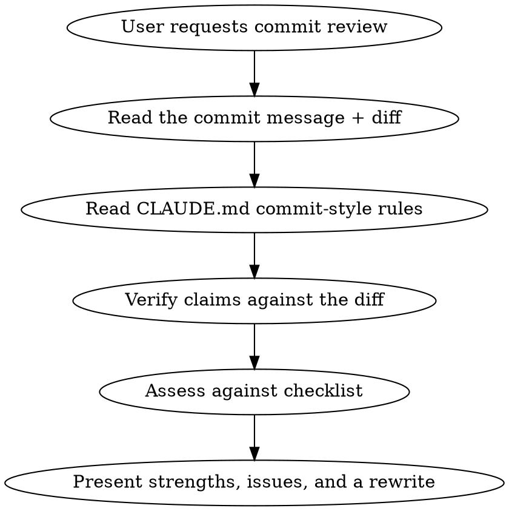

# Commit Message Review

## Overview

Review a git commit message as a senior software engineer would: judge it against
what makes a commit message genuinely good, then hand back a concrete, improved
rewrite. The goal is clarity, correct causal reasoning, and elegance.

Do **not** calibrate against the repository's existing commit history — the log is
casual and inconsistent, and matching it is not the goal. Hold every message to a
high standard regardless of what neighboring commits look like. The one repo source
worth honoring is the commit-style section declared in `CLAUDE.md` (subject format,
why-then-how body, no bullet points, length limit).

## When to Use

- "Review the current commit message"
- "Critique / improve this commit message"
- "Is my commit message any good?"
- Before pushing or opening a PR, as a final polish on the top commit

By default review `HEAD`. If the user names a ref (`HEAD~2`, a SHA, a range),
review that instead.

## Workflow

## Information to Gather

Never review a message in isolation from the change it describes:

1. **Full message + diff stat**: `git show HEAD --stat --format=full`
2. **The actual code diff**: `git show HEAD` — the message must be true to the code.
3. **Declared style rules**: read the commit-message section of `CLAUDE.md` for the
   subject format, body rules, and length limit. This is the one convention to honor.
4. **Cross-check symbols named in the message** (functions, params, callers) against
   the tree with `grep` — catch stale identifiers and unstated scope risks (e.g.
   other callers of a changed signature that the message should have ruled out).

## Review Checklist

Judge the message on these axes. Cite the specific line for each issue.

- **Subject line**
  - Follows the format declared in CLAUDE.md and is under the length limit
    (72 chars unless stated otherwise); imperative mood.
  - Leads with the *effect/behavior*, not a mechanical restatement of the diff.
  - Identifiers in the subject are the *real* ones in the code (not paraphrased).
- **Body — why then how**
  - First paragraph states the motivation: the bug, current behavior, or need.
  - The **root cause is a mechanism, not a symptom** — name *why* it breaks
    (type mismatch, off-by-one, stale cache…), not just what the user saw.
  - The **consequence** is spelled out (what the defect actually does: hang,
    crash, wrong value), not left to inference.
  - Later paragraphs state what changed and the key design choices.
  - Assumes reader knows the codebase but not the context of this change.
- **Correctness & honesty**
  - Every claim matches the diff. No overclaiming ("fixes all X") beyond scope.
  - Scope risks a reviewer would ask about (other callers, behavior changes) are
    pre-empted or noted.
- **Prose quality**
  - Grammar, subject-verb agreement, consistent tense (present).
  - Concise paragraphs; no bullet points or numbered lists in the body.

## Output Format

Present the review in three parts, in this order:

1. **What's already good** — 1-3 points. Be genuine; anchor the rewrite in what to keep.
2. **Where it can be sharper** — numbered issues, each citing the offending line
   and giving the fix and the reason. Prioritize substance (causal reasoning,
   correctness) above grammar.
3. **Suggested rewrite** — a complete, ready-to-use message in a code block,
   in the CLAUDE.md style. Then one sentence on any judgment call the user
   still owns (e.g. effect-first vs mechanism-first subject).

## Principles

- The message must be true to the diff — always read the code, not just the text.
- Hold a high bar independent of the surrounding git log; do not grade on a curve.
- Push causal precision: a good message explains *why it broke* and *what that
  caused*, so a future reader debugging a regression can reason from it.
- Suggest, don't rewrite the commit. Do not amend or force-push unless the user
  explicitly asks; if they do, confirm the message first per repo commit rules.
