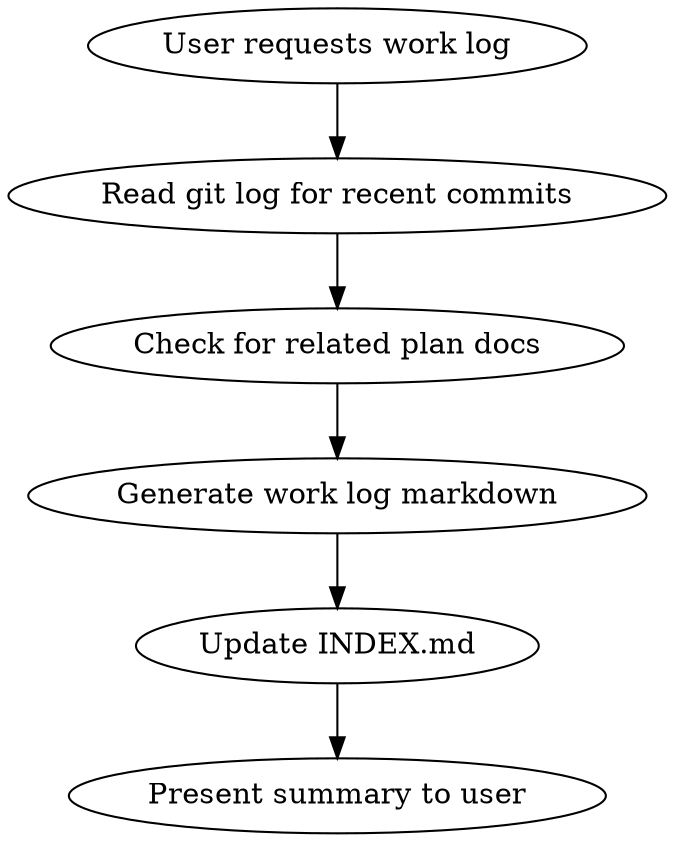

# Work Log Generation

## Overview

Generate a professional work log documenting a completed development task. The log captures objectives, changes, technical decisions, and links to relevant commits.

## When to Use

- After completing a feature, bugfix, or refactoring task
- At the end of a work session to document progress
- When asked to "write a work log" or "document this work"

## Workflow



## Information to Gather

1. **Git history**: Recent commits on current branch with full messages
2. **Plan documents**: Check `docs/plans/` for related analysis
3. **Changed files**: `git diff --stat` for scope of changes
4. **Branch name**: Often indicates the work topic

## Work Log Structure

```markdown
# Work Log: [Descriptive Title]

**Date**: YYYY-MM-DD
**Author**: [Name]
**Branch**: `branch-name`
**Commit**: `hash` - [commit subject]
**Status**: Completed | In Progress

---

## 1. Objective
[What the work aimed to accomplish]

## 2. Background
[Context, related discussions, why this was needed]

## 3. Changes Implemented
[Summary of what was done, organized by subsystem or theme]

## 4. Technical Decisions
[Key choices made and rationale]

## 5. Verification
[How the changes were tested/verified]

## 6. Known Issues and Future Work
[What remains, documented limitations]

## 7. References
[Links to plan docs, discussions, related code]
```

## Index Entry Format

The INDEX.md should use a table with semantic descriptions:

```markdown
| Date | File | Commit | Description |
|------|------|--------|-------------|
| YYYY-MM-DD | [filename.md](filename.md) | `hash` | High-level description of what was accomplished |
```

**Index descriptions should be:**
- Semantic (what was achieved, not technical details)
- Abstract (no macro names, parameters, or code specifics)
- Concise (one sentence summarizing the work unit)

## File Locations

- Work logs: `docs/work-logs/YYYY-MM-DD-topic-name.md`
- Index: `docs/work-logs/INDEX.md`

## Commands to Run

```bash
# Get recent commits with full messages
git log -1 --format="%H%n%s%n%n%b" [commit-hash]

# Get commit summary
git log --oneline -5

# Get changed files
git diff --stat HEAD~1

# Check for plan documents
ls docs/plans/
```

## Common Mistakes

- Including too much technical detail in INDEX.md descriptions
- Forgetting to link the commit hash
- Not checking for related plan documents that provide context
- Writing implementation details instead of objectives and decisions
